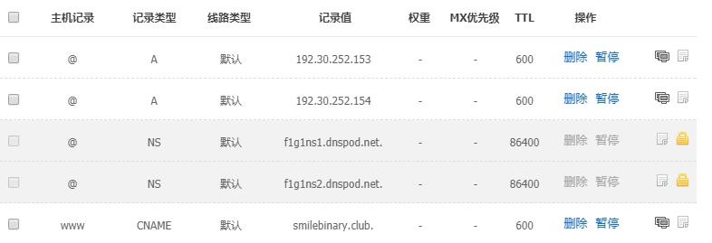

简介：个人搭建个人博客指南，包括了基本的步骤和搭建过程中遇到的一些小坑，总体来说比较繁琐，但是不难。

内容：域名，DNS，GitHub Pages，hexo

## GitHub Pages 

GitHub Pages 用于介绍 GitHub的项目或者作为个人主页。因为免费稳定，所以用来做搭建一个博客那也是极好的。

## 购买域名

我在GoDaddy是在上购买，其他的方案自行研究吧。

整个过程基本和网上购物类似，搜索想要的域名，加入购物车，购买。各种服务我都没有要，只求最便宜。

一般小众的域名后缀比较廉价哈哈哈，另外*去网上搜个优惠码可以优惠！*，自己忘了没用感觉亏了一个亿

## 安装Node.js，Git。这个就不多说了，有问题查阅相关文档

[Git中文教程](http://progit.org/book/zh/)

## 配置GitHub（已经配置好的跳过）

注册GitHub，正常账号注册。

## #配置SSH

（windows下）打开安装好的git bash，输入

``` bash
$ cd ~/.ssh
$ ssh-keygen -t rsa -C "(个人邮箱)@yy.com"
```

之后可以多次直接敲击空格完成生成

登录GitHub系统；点击右上角账号头像的“▼”→Settings→SSH kyes→Add SSH key。

复制id_rsa.pub的公钥内容。 

1) 进入c:/Users/.ssh/目录下，打开id_rsa.pub文件，全选复制公钥内容。

2) Title自定义，将公钥粘贴到GitHub中Add an SSH key的key输入框，最后“Add Key”。

配置账户git bash中：

$ git config --global user.name “your_username”  #设置用户名

$ git config --global user.email “your_registered_github_Email”  #设置邮箱地址

测试ssh配置

``` bash
$ ssh -T git@GitHub.com
The authenticity of host 'GitHub.com (207.97.227.239)' cant be established. RSA key fingerprint is 16:27:ac:a5:76:28:2d:36:63:1b:56:4d:eb:df:a6:48. Are you sure you want to continue connecting (yes/no)? 
$ yes
Youve successfully authenticated, but GitHub does not provide shell access. 
```

## 将独立域名与 GitHub Pages 的空间绑定DNS 设置

我使用了DNSpod，DNSPod的帮助文档：https://www.dnspod.cn/Support



其中 A 的两条记录指向的ip地址是 GitHub Pages 的提供的 ip

192.30.252.153
192.30.252.154
如博客不能登录，有可能是 GitHub 更改了空间服务的 ip 地址，记得及时到在GitHub Pages查看最新的 ip 即可

www 指定的记录是你在 GitHub 注册的仓库。

## GoDaddy 修改 DNS 地址

GoDaddy在管理DNS中域名服务器使用自定义域名服务器，Nameservers 更改成f1g1ns1.dnspod.net和f1g1ns2.dnspod.net，也就是DNSpod的域名服务器的域名，具体原理参见域名服务器的层次。（可能要几小时生效）

## GitHub Pages 建立博客

在浏览器打开GitHub建立新的仓库，命名为username.GitHub.io，clone仓库，建立一个index.html,push到GitHub的master分支。

另外在项目根目录中建立一个名为CNAME的文件，内容为：

``` bash
username.你的域名后缀
```

之后就可以通过域名或者username.github.io访问你建的主页了。（最长可能需要一天才能生效）

### 这是一个简单的博客开始，接下来为了更加丰富的博客内容你有两个选择，自己手撸web，当然像我这种懒人当然是选个模板就好了（自己写的丑的不想用）
如果你和我一样，可以参考这篇[hexo搭建博客](http://www.smilebinary.club/2018/01/08/hexo搭建博客/)

参考文档
[](http://www.cnfeat.com/blog/2014/05/11/how-to-build-a-blog/)
[](http://beiyuu.com/github-pages)


